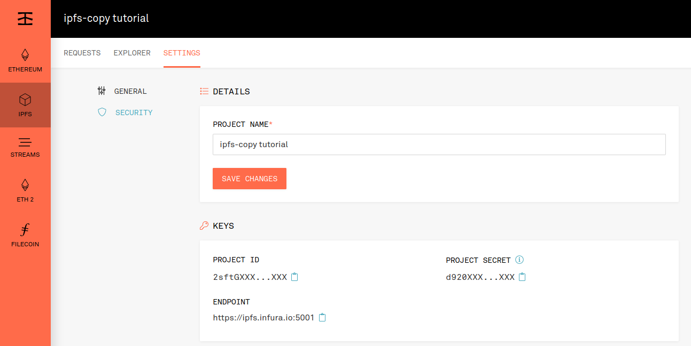

# Migration - new Infura users
If you aren't an existing Infura customer and store your data on a self-hosted IPFS node, you can migrate too! Focus on your business and let Infura handle all the IPFS infrastructure and monitoring.

## Step 1 - Create your Infura IPFS Project
To interact with the Infura IPFS API, you need to [register your account](https://infura.io/register) and set up your IPFS project.

After the registration, you will be redirected to the settings page, where you find your credentials to authenticate with:
- **PROJECT_ID**
- **PROJECT_SECRET**



## Step 2 - Build the `ipfs-copy` command
Using `go get`:
```bash
go get -u github.com/INFURA/ipfs-copy
```

Cloning the source code manually and compiling it:
```
git clone https://github.com/INFURA/ipfs-copy.git
cd ipfs-copy
make install
```

Or by downloading a [pre-built binary](https://github.com/INFURA/ipfs-copy/releases/tag/v1.0.0) from the release page.

## Step 3 - Migrate your content
The `ipfs-copy` command **will iterate all pins from the source node, copy the blocks and then pin them** to your Infura IPFS project in parallel with multiple workers for optimal performance.

### Run `ipfs-copy` using flags
```bash
ipfs-copy --source-api-url=http://localhost:5001 --project-id=<YOUR_PROJECT_ID> --project-secret=<YOUR_PROJECT_SECRET>
```
- optional flag `--workers=1` defines how many CIDs to pin in parallel (**default:** 1)
- optional flag `--cids-failed=/tmp/failed_pins.txt` defines an absolute path where failed pins will be logged

### Run `ipfs-copy` using ENV variables
The `.env` contains:
- IC_SOURCE_API_URL
- IC_PROJECT_ID
- IC_PROJECT_SECRET
- IC_WORKERS
- IC_CIDS_FAILED

```bash
cp new-self-hosted-users-sample.env .env

source .env && ipfs-copy
```

Done! You have migrated your content to Infura IPFS service!

---
## Bonus step - limit traffic from a specific IP
Configure your IP inside the **Allowlist -> Limit IP Access** in your project's security settings to restrict access only from a desired list of IPs.
